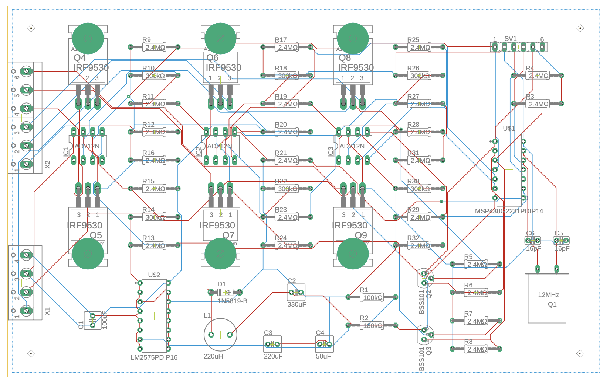
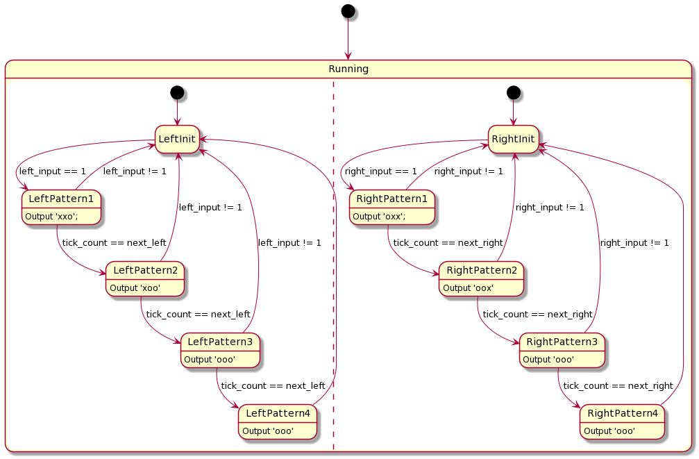
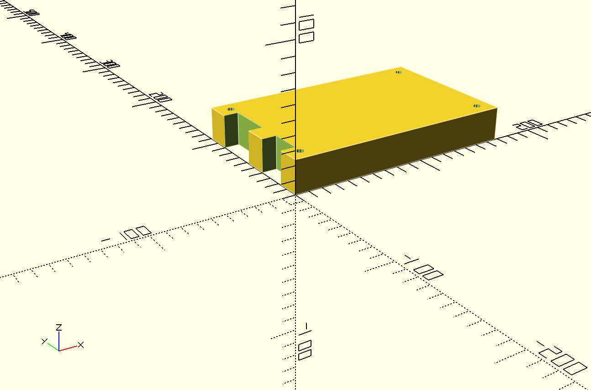

# Sequential Turn Signal
[中文指南](https://github.com/m-yuhas/sequential_turn_signal/blob/master/doc/读我档案.md)

[Documentación en español](https://github.com/m-yuhas/sequential_turn_signal/blob/master/doc/LÉAME.md)

[Documentation en français](https://github.com/m-yuhas/sequential_turn_signal/blob/master/doc/LISEZ-MOI.md)

## Introduction
On modern vehicles sequential turn signals are rapidly increasing in popularity.
A sequential turn signal is a turn signal which is divided into multiple
segments that illuminate in some dynamic pattern when the signal is activated.
While this functionality comes built in to many modern vehicles, this project
seeks to provide a simple method to introduce this functionality to classic cars
without having to replace the existing turn signal lights.  The software and
hardware are configured by default for a vehicle with three independent rear turn
signal lamps on each side of the vehicle, but can be adapted for other
configurations if needed.

If you plan to install this system on your vehicle, please read this entire
guide and understand what tools and skills you will need to complete this
project before beginning.  A high level of automotive and electronics experience
is recommended as this system has not yet been tested in an operating
environment.  Furthermore, it was designed for a specific vehicle and
modifications may be required to use it in another.

Please check the local regulations regarding modifications to vehicles before
starting.  This system will also introduce sequential behavior when the break
lights first illuminate, which may or may not be legal in your jurisdiction.
Additionally please understand the risks to yourself, your vehicle, and those
with whom you share the road.  These include, but are not limited to
electrocution, fire, messing up your vehicle's wiring harness, and ending up
with a vehicle with no working turn signals or break lights.  Proceed at your
own risk.

## Building the System
This system is composed of three components: a PCB with the microcontroller and
electronics; firmware, which runs on the microcontroller; and an enclosure to
offer some protection for the functional components of the system.  Each of the
sections below contains more details about each component, how to build it, and
some possible modifications.

### PCB

The schematic and PCB were created with
[EAGLE](https://www.autodesk.com/products/eagle/overview?term=1-YEAR). The
project can be loaded from the files in this repository's pcb folder.  Here are
the steps to build:
1. Use EAGLE to export Gerber files from the main.brd file.  You can follow
  [these instructions](https://www.autodesk.com/products/eagle/blog/gerber-nc-drill-pcb-manufacturing-basics-1/) from Autodesk.
2. Find a PCB manufacturer and send the Gerber files and Excellon drill files
  for manufacture.
3. You should receive a blank PCB from the manufacturer.  All the components
  were selected as through-hole to make home assembly easier.  You will need to
  purchase all the parts by model number as shown on the schematic.
4. Solder the components to the PCB.

Some things to consider:
1. This PCB intercepts the right and left turn signal lines and splits each into
  three signals lines for each individual lamp.  Assuming 30 Watt brake lamps,
  some of these traces will be passing up to 2.5 Amps, so if possible it is
  recommended to widen some of these traces to reduce resistance and mitigate
  the risk of thermal failure of the PCB.
2. The connectors for power, ground, input, and output are not automotive grade.
  They were selected as screw-in connectors to make debugging easier.  These
  should be replaced with proper connectors if possible.
3. The PCB layout contains sufficient space for a toroidal inductor for the
  switched mode power supply.  If you plan on making your own inductor, you can
  calculate the number of turns required using [this guide](http://www.nessengr.com/technical-data/toroid-inductor-formulas-and-calculator/).
  Remember to choose a wire thick enough to support up to 1 Amp.

### Software

The software component is composed of two finite state machine running on an
MSP430 microcontroller.  There is one FSM for each turn signal: when the input
signal line goes high, the FSM begins traversing through the output pattern
vectors with transitions based on times.  Once the input signal line goes low,
the FSM is reset.

The software was created with TI's [Code Composer Studio](https://www.ti.com/tool/CCSTUDIO).
You can load the project with the files in this repository's firmware folder.
Here are the steps to compile the firmware and load it on the PCB:
1. Buy an [MSP430 programmer](https://www.ti.com/tool/MSP-FET).
2. Open the Code Composer Studio project in this repository's firmware folder.
3. Connect the programmer to the debug header on the PCB.  The PCB's debug
  header is designed to communicate with the programmer using SBW and UART.
4. Follow the instructions in the [Code Composer Studio manual](https://www.ti.com/lit/ug/spru509h/spru509h.pdf)
  to flash the device.
5. When power is introduced on the PCB's 12 V power supply input, the MSP430
  should boot.  You can verify functionality by supplying 12 V to either left or
  right signal inputs and monitoring the voltages on the output pins.

Some things to consider:
1. You can define custom patterns using the macros at the top of the main.c file
2. You can speed up or slow down the sequential pattern by changing the
  definition of TIMER_RESOLUTION_TICKS in main.c
3. The version of the MSP430 used in this project only has one 8-bit port.  If
  your vehicle has more than six individual lamps (3 per side) that need to be
  controlled, you will need to select a different microcontroller and redesign
  the PCB.

### Enclosure

The enclosure was designed using [OpenSCAD](https://openscad.org/).  This is not
a weatherproof design and the goal is to provide a minimum level of protection
for the PCB.  As such, it is recommended to install the enclosure in the
interior of the vehicle.

The enclosure CAD drawings are meant as a rough guide.  You can machine your own
metal enclosure based on the the drawings or convert them to STL files and 3D
print the pieces.  If the enclosure is 3D printed, please ensure that a plastic
is used which can handle the thermal extremes that can be found inside a
vehicle.

## Installing the System

The system has the following connections with the vehicle's wiring:
* **Power** - 12 V from the vehicle's low voltage battery.  Ideally this should
  come from a line that is high when the system is needed and low when the
  vehicle is parked for long durations.  This is because the microcontroller
  will be running anytime voltage is supplied on this input and could drain the
  battery if the vehicle is parked for a long time.  
* **Ground** - Vehicle ground; this can be connected to the vehicle chassis.
* **Right signal in** - Vehicle's original 12 V line to the right turn signal.
* **Left signal in** - Vehicle's original 12V line to the left turn signal.
* **Right signal out 1** - Connection between the system and the rear inner
  right turn signal lamp.
* **Right signal out 2** - Connection between the system and the rear center
  right turn signal lamp.
* **Right signal out 3** - Connection between the system and the rear outer
  right turn signal lamp.
* **Left signal out 1** - Connection between the system and the rear inner left
  turn signal lamp.
* **Left signal out 2** - Connection between the system and the rear center left
  turn signal lamp.
* **Left signal out 3** - Connection between the system and the rear outer left
  turn signal lamp.
