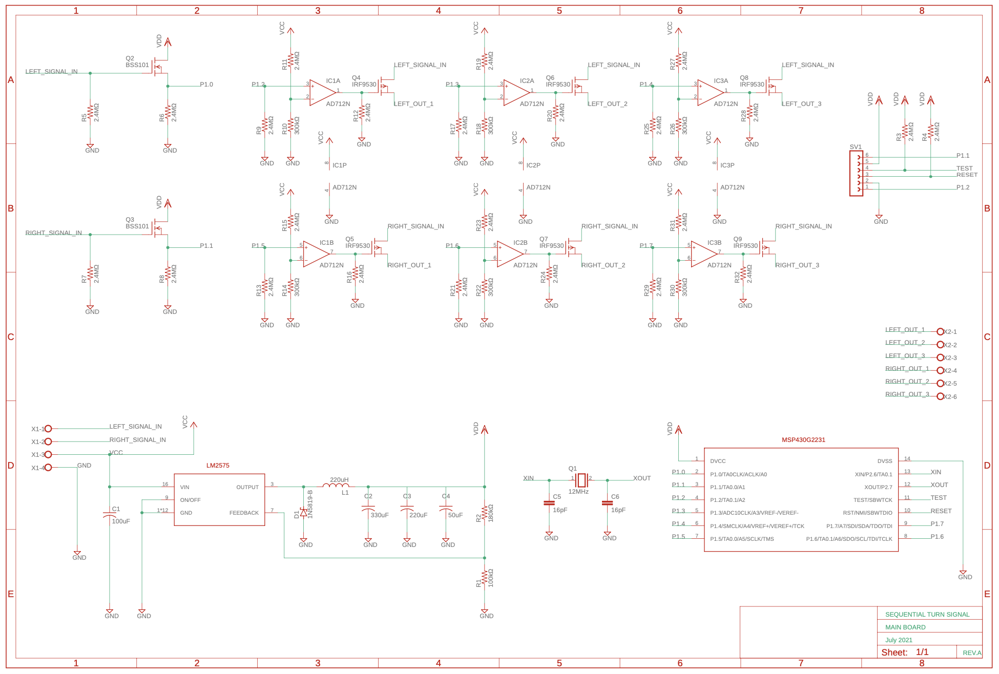
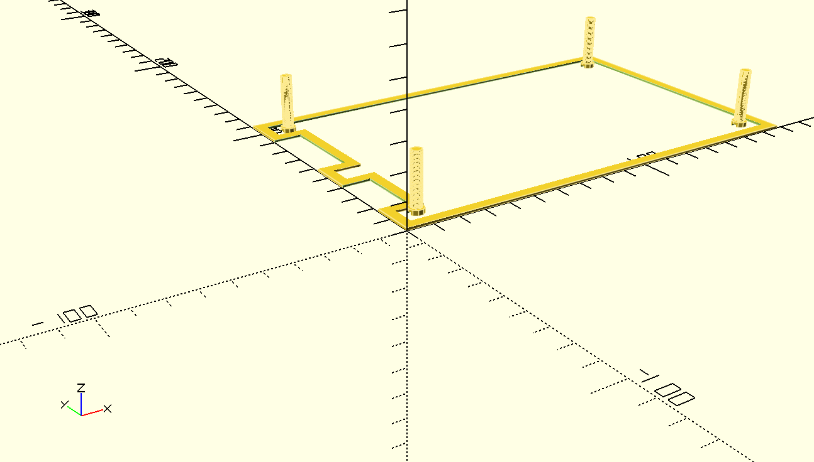

# Intermitente Secuencial

## Introducción
En vehículos modernos intermitentes secuenciales se están creciendo rápidamente
su popularidad. Un intermitente secuencial es un intermitente cual es dividido
en segmentos múltiples que se iluminan en un patrón dinámico cuando la señal
está activada.  Mientras esta funcionalidad ya es incorporada en muchos
vehículos modernos, este proyecto busca proprocionar un método sencillo para
introducir esta funcionalidad en coches clásicos sin necesitando la remoción de
los intermitentes originales.  El software y el hardware son configurados por
defecto para un vehículo con tres lámparas de intermitente trasero
independientes en cada lado del vehículo, pero pueden estar adaptados para
configuraciones otras si es necesario.

Si planifica usted instalar este sistema en su vehículo, por favor lea esta guía
enteramente y comprender que son las herramientas y las habilidades requeridas
para completar este proyecto antes de empezar.  Un nivel altíssimo de
experiencia automotriz y electrónica es recomendado como este sistema ya no ha
probado en un medio ambiente operacional.  Además, no estaba diseñado para un
vehículo específico y tal vez modificaciones son necesarios para usarlo en otro
vehículo.

Por favor verificar las regulaciones locales con respecto a modificaciones de
vehículos antes de empezar.  Este sistema también introducirá el funcionamiento
secuencial cuando las luces de freno iluminar al principio, cual podría o no
podría ser legal en su jurisdicción.  Adicionalmente por favor comprender los
riesgos a su mismo, su coche, y la gente con quién comparte el camino.  Estos
riesgos incluyen, pero no se limitan a electrocución, fuego, estropeando el
arnés de cableado de su vehículo, y acabando con un vehículo con intermitentes o
luces de freno que no funcionan.  Proceda a su mismo riesgo.

## Construir el Sistema
Este sistema consiste de tres componentes: una placa de circuito impreso con
un microcontrolador y la electrónica; firmware, cual ejecuta en el
microcontrolador; y una caja para ofrecer alguna protección para los componentes
funcionales del sistema.  Cada de las secciones siguientes contiene más detalles
sobre cada componente, cómo construirlo, y unas modificaciones posibles.

### Placa de Circuito Impreso

El esquematismo y la placa de circuito impreso estaban creados con
[EAGLE](https://www.autodesk.com/products/eagle/overview?term=1-YEAR). El
proyecto puede estar cargado de los archivos en la carpeta de 'pcb' en este
repositorio.  Aquí son los pasos para construirlo:
1. Use EAGLE para exportar los archivos Gerber del archivo main.brd.  Usted
  puede seguir [estas instrucciones](https://www.autodesk.com/products/eagle/blog/gerber-nc-drill-pcb-manufacturing-basics-1/) de Autodesk.
2. Encuentre un fabricante de placas de circuito impreso y le envíe al
  fabricante los archivos Gerber y los archivos Excellon para fabricarlos.
3. Debe recibir una placa de circuito impreso blanco del fabricante.  Todos los
  componentes estaban seleccionados como tecnología de agujeros pasantes para
  hacer el montaje en casa más fácil.  Necesitará comprar todas las partes por
  el número de modelo como se muestra el esquematismo.
4. Suelde los componentes en la placa de circuito impreso.

Algunas cosas para considerar:
1. Esta placa de ciruito impreso intercepta las líneas de los intermitentes
  derechos e izquierdos y separa cada en tres señales, una para cada lámpara
  individual.  Si asumimos una lámpara de freno consume 30 vatios, unos de estos
  rastros pasarán hasta 2.5 amperios. Así si es posible es recomendado ensanchar
  unos de estos rastros para reducir la resistencia y mitigar el riesgo del
  fracaso térmico de la placa de circuito impreso.
2. Los conectores para el poder, la tierra, la entrada, y la salida no son de la
  calidad automatriz.  Estaban seleccionados como conectores de tornillo para
  hacer más fácil la depuración.  Deben estar reemplazados con conectores
  adecuados si es posible.
3. El arreglo de la placa de circuito impreso contiene espacio suficiente para
  un inductor toroidal para el fuente conmutada.  Si planifica hacerse su propio
  inductor, puede calcular el número de veultas requeridas usando [esta guía](http://www.nessengr.com/technical-data/toroid-inductor-formulas-and-calculator/).
  Recuerda escoger un alambre lo suficiente ancho para llevar hasta 1 amperio.

### Software

El componente software se compone de dos autómatas finitos que ejecutan en un
microcontrolador MSP430.  Hay un autómata finito para cada intermitente: cuando
la línea de señal entrada va arriba, el autómata finito empieza atravesar los
vectores de patrones salidos con transiciones basadas en tiempos.  Una vez la
línea de señal entrada va abajo, el autómata finito se reinicia.

El software estaba creado usando el [Code Composer Studio](https://www.ti.com/tool/CCSTUDIO)
de TI.  Usted puede cargar el proyecto con los archivos en la carpeta de
'firmware' de este repositorio.  Aquí están los pasos para compilar el firmware
y cargarlo en la placa de circuito impreso:
1. Compre un programador [programador MSP430](https://www.ti.com/tool/MSP-FET).
2. Abra el proyecto de Code Composer Studio en la carpeta de 'firmware' de este
  repositorio.
3. Conecte el programdor al conector de depuración en la placa de circuito
  impreso.  El conector de depuración en la placa de circuito impreso estaba
  diseñado para comunicar al programador usando SBW y UART.
4. Siga las instrucciones en el [manual del Code Composer Studio](https://www.ti.com/lit/ug/spru509h/spru509h.pdf)
  para cargar el firmware en el dispositivo.
5. Cuando introduzca el poder a la entrada del fuente de poder de 12 V de la
  placa de circuito impreso, el MSP430 debe iniciar.  Puede verificar la
  funcionalidad en proveyendo 12 V a la entrada de señal izquierda o la entrada
  de señal derecha y observando los voltajes en las clavijas salidas.

Unas cosas para considerar:
1. Puede definir los patrones a medida usando las macros en el principio del
  archivo main.c
2. Puede acelerar o desacelerar los patrones secuenciales en cambiando la
  definición de TIMER_RESOLUTION_TICKS en main.c
3. La versión del MSP430 cual estaba usada en este proyecto solo tiene uno
  puerto 8-bit.  Si su vehículo tiene más que seis lámparas individuales (tres
  por lado) que necesitan ser controladas, necesite seleccionar un
  microcontrolador diferente y rediseñar la placa de circuito impreso.

### Caja

La caja estaba diseñada usando [OpenSCAD](https://openscad.org/).  No es un
diseño impermeabilizado y la meta es provee un nivel de protección mínimo para
la placa de circuito impreso.  Por ello, es recomendado instalar la caja el el
interior del vehículo.

Los dibujos CAD de la caja sirven de una guía aproximada.  Puede fabricar a
máquina su propio caja metal basado en los dibujos o convertirlos en archivos
de STL e imprimirlos en 3D.  Si imprime en 3D la caja, por favor se asegure que
use un plástico que puede manejar los extremos térmicos que puede encontrar en
un vehículo.

## Instalar el Sistema

El sistema tiene las conexiones siguientes con el cableado del vehículo:
* **Poder** - 12 V de la pila de voltaje bajo del vehículo.  Idealmente debe
  venir de una línea que es alta cuando el sistema esté necesitado y bajo cuando
  el vehículo esté estacionado por duraciones largas.  Este es porque el
  microcontrolador funcionará en cualquier momento que hay un voltaje en esta
  entrada y podría vaciar la pila si el vehículo quede estacionado por mucho
  tiempo.
* **Tierra** - la tierra del vehículo; esta puede ser conectada al chasis del
  vehículo.
* **Entrada del intermitente derecho** - La línea de 12 V originalmente al
  intermitente derecho del vehículo.
* **Entrada del intermitente izquierdo** - La línea de 12 V originalmente al
  intermitente izquierdo del vehículo.
* **Salida del intermitente derecho 1** - La conexión entre el sistema y la
  lámpara del intermitente derecho trasero más interno.
* **Salida del intermitente derecho 2** - La conexión entre el sistema y la
  lámpara del intermitente derecho trasero medio.
* **Salido del intermitente derecho 3** - La conexión entre el sistema y la
  lámpara del intermitente derecho trasero periférico.
* **Salida del intermitente izquierdo 1** - La conexión entre el sistema y la
  lámpara del intermitente izquierdo trasero más interno.
* **Salida del intermitente izquierdo 2** - La conexión entre el sistema y la
  lámpara del intermitente izquierdo trasero medio.
* **Salido del intermitente izquierdo 3** - La conexión entre el sistema y la
  lámpara del intermitente izquierdo trasero periférico.
